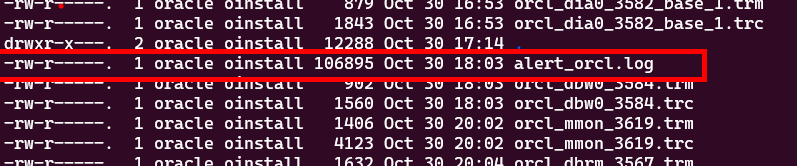

### Alert logs
- Go to trace folder </p>
- Find the file alert_$ORACLE_SID.log
```bash
cd $ORACLE_BASE/diag/rdbms/$ORACLE_SID/$ORACLE_SID/trace
ls -lart # see the alert log
```


See tha patch numbers </p>


Alert logs contain important information about error messages and exceptions that occur during database operations.

- Start database in nomount mode

```bash
sqlplus / as sysdba
SQL> shutdown
SQL> STARTUP NOMOUNT
SQL>EXIT
```
- investigate the logs
- There are three startup stages of an oracle database, **nomount, mount and open** 
-  In nomount stage, background oracle database processes are created  and allocates memory structures, but it does not access the control file or open the database itself. This stage is typically used when you want to create a new database or perform certain maintenance tasks that do not require the database to be open. It allows you to specify parameters and initialize the instance without actually mounting the database.
- see in nomount stage pmon trace file is created.
- In nomount mode, resource alocation is done, BG processes are created, PFILE is read


- Check spfile both from SQLPLUS and from alert logs

```bash
SQL>show parameter pfile

```
- see the output
```
/u01/app/oracle/product/19.3.0/dbhome_1/dbs/spfileorcl.ora
```

find the spfile parameter from alert logs
```bash
grep '/u01/app/oracle/product/19.3.0' alert_orcl.log
```


