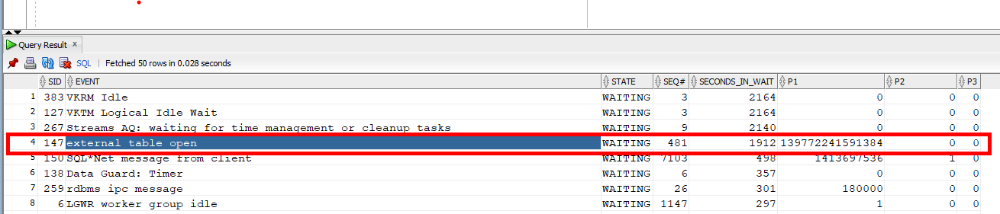
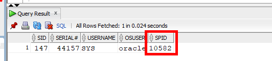
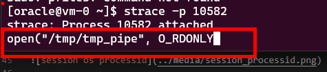

#### Oracle Wait Events with Strace
This document is exactly the same as [advanced-oracle-troubleshooting-guide-when-the-wait-interface-is-not-enough-part-1](https://tanelpoder.com/2007/06/18/advanced-oracle-troubleshooting-guide-when-the-wait-interface-is-not-enough-part-1/) but using Oracle Linux 7.9 on Azure VM.

```bash
mknod /tmp/tmp_pipe p
```

```sql
CREATE DIRECTORY dir AS '/tmp';
CREATE TABLE ext (
       value number
    )
    ORGANIZATION EXTERNAL (
      TYPE oracle_loader
      DEFAULT DIRECTORY dir
        ACCESS PARAMETERS (
        FIELDS TERMINATED BY ';'
        MISSING FIELD VALUES ARE NULL
       (value)
       )
       LOCATION ('tmp_pipe')
     )
   ;


select * from ext; -- this will make the query waut
```
open another SSH terminal to the VM

```sql
select sid, event, state, seq#, seconds_in_wait, p1,p2,p3
    from v$session_wait
```


Get OS process id of the session 

```sql
select a.sid, a.serial#,a.username, a.osuser, b.spid
from v$session a, v$process b
where a.paddr= b.addr
and a.sid=147
order by a.sid;
```



```bash
strace -p 10582
```
