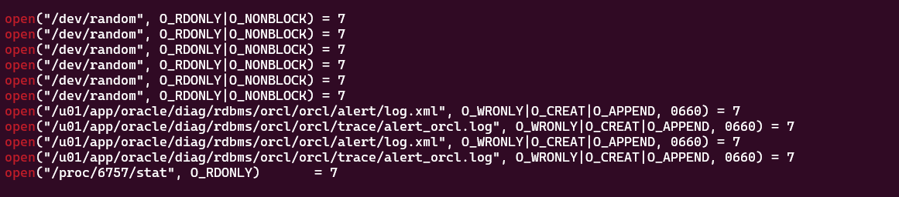
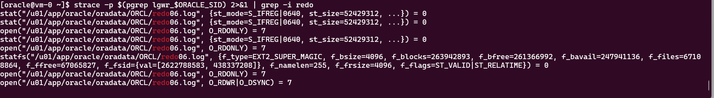

### LogSwitch in Oracle

**Log Switch Occurs:** A log switch happens when the current online redo log file group becomes full. Oracle continuously writes database changes (redo data) to these online redo log files to ensure data durability and recoverability.

**Initiates Checkpoint:** When a log switch occurs, it also initiates a checkpoint, ensuring that all the data changes made up to that point are flushed to the data files, which helps maintain database consistency.

**Frequency:** The frequency of log switches depends on several factors, including the size of the redo log files, the volume of database changes, and the database's configuration. You can monitor log switch frequency to optimize the database's performance and resource utilization.


```sql
select 
to_char(first_time,'yyyy-mm-dd') day,
to_char(first_time,'hh24') hour,
count(*) total 
from 
v$log_history
group by 
to_char(first_time,'yyyy-mm-dd'),to_char(first_time,'hh24')
order by 
to_char(first_time,'yyyy-mm-dd'),to_char(first_time,'hh24')
ASC;
```

We'll execute strace to track log switch events. Yet, in contrast to previous versions of Oracle Database, the open system call for the associated redo log file remains unseen to us.

```bash
 strace -p $(pgrep lgwr_$ORACLE_SID) 2>&1 | grep -i open
```

```sql
alter system switch logfile;
alter system switch logfile;
alter system switch logfile;
alter system switch logfile;
alter system switch logfile;
```




so question is when does lgwrt process open redo logs. To test it we will create redo log file and continue strace operation on logwriter process
```sql
ALTER DATABASE ADD LOGFILE GROUP 6 ('/u01/app/oracle/oradata/ORCL/redo06.log') 
SIZE 50M;
```

we will observe that again lgwrt does not open to redo06. But if we switch redo logs again then we will observe lgwrt opens redo log file.

```sql
alter system switch logfile;
```



####Conclusion
The LGWRT process initiates an open system call whenever it needs to access a redo log file that isn't already open. After opening a redo file, it maintains the file open, even when it switches over to a different redo file, without executing a close operation.
