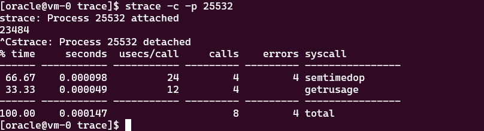
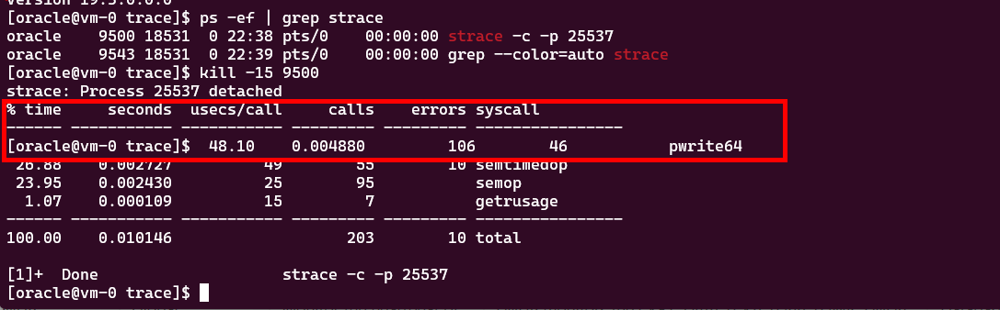

### What is strace
Strace is a powerful diagnostic and debugging utility for Linux, used to monitor and analyze interactions between processes and the operating system

### Tracing LogWriter Process
```bash
ps -ef | grep lgwr
ps -ef | grep lg00
strace -c -p 23484
```
- trace lg00 or lg0x process. On multiprocessor systems, LGWR creates worker processes to improve the performance of writing to the redo log. LGWR workers are not used when there is a SYNC standby destination.

- From the output above it is clear that logwriter could not find anything in the logbuffer to write something to the disk. Now execute the SQL Statement to trigger log writer, and trace with strace tool

```SQL
CREATE TABLE OrderTable(OrderID, StaffID, CustomerID, TotalOrderValue)
as (select level, ceil(dbms_random.value(0, 1000)), 
                  ceil(dbms_random.value(0,10000)), 
                  round(dbms_random.value(0,10000),2) 
    from dual 
    connect by level <= 1000000);
/
```


[References]
- https://www.appsloveworld.com/oracle/100/25/oracle-insert-x-amount-of-rows-with-random-data
- https://docs.oracle.com/en/database/oracle/oracle-database/21/refrn/background-processes.html#GUID-86184690-5531-405F-AA05-BB935F57B76D
- https://fritshoogland.files.wordpress.com/2014/04/profiling-the-logwriter-and-database-writer.pdf
